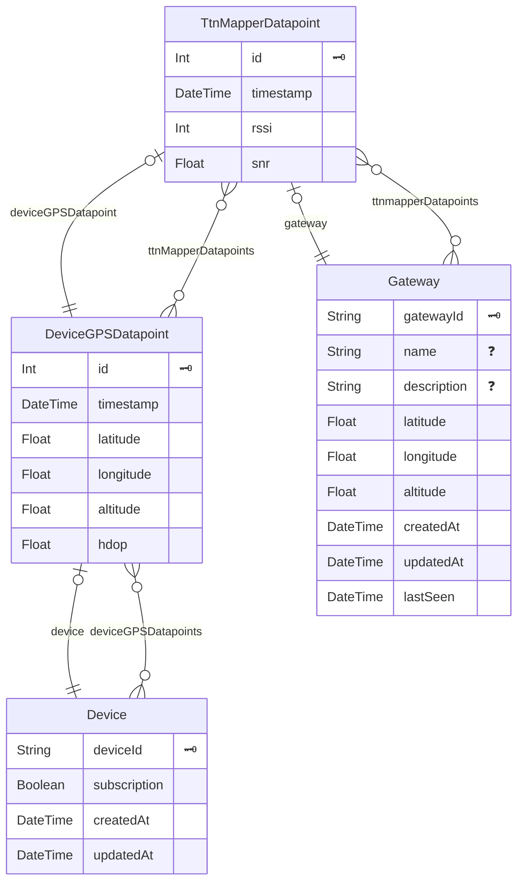

```mermaid
erDiagram

  "TtnMapperDatapoint" {
    Int id "🗝️"
    DateTime timestamp
    Int rssi
    Float snr
    }


  "DeviceGPSDatapoint" {
    Int id "🗝️"
    DateTime timestamp
    Float latitude
    Float longitude
    Float altitude
    Float hdop
    }


  "Device" {
    String deviceId "🗝️"
    Boolean subscription
    DateTime createdAt
    DateTime updatedAt
    }


  "Gateway" {
    String gatewayId "🗝️"
    String name "❓"
    String description "❓"
    Float latitude
    Float longitude
    Float altitude
    DateTime createdAt
    DateTime updatedAt
    DateTime lastSeen
    }

    "TtnMapperDatapoint" o|--|| "DeviceGPSDatapoint" : "deviceGPSDatapoint"
    "TtnMapperDatapoint" o|--|| "Gateway" : "gateway"
    "DeviceGPSDatapoint" o|--|| "Device" : "device"
    "DeviceGPSDatapoint" o{--}o "TtnMapperDatapoint" : "ttnMapperDatapoints"
    "Device" o{--}o "DeviceGPSDatapoint" : "deviceGPSDatapoints"
    "Gateway" o{--}o "TtnMapperDatapoint" : "ttnmapperDatapoints"
```
